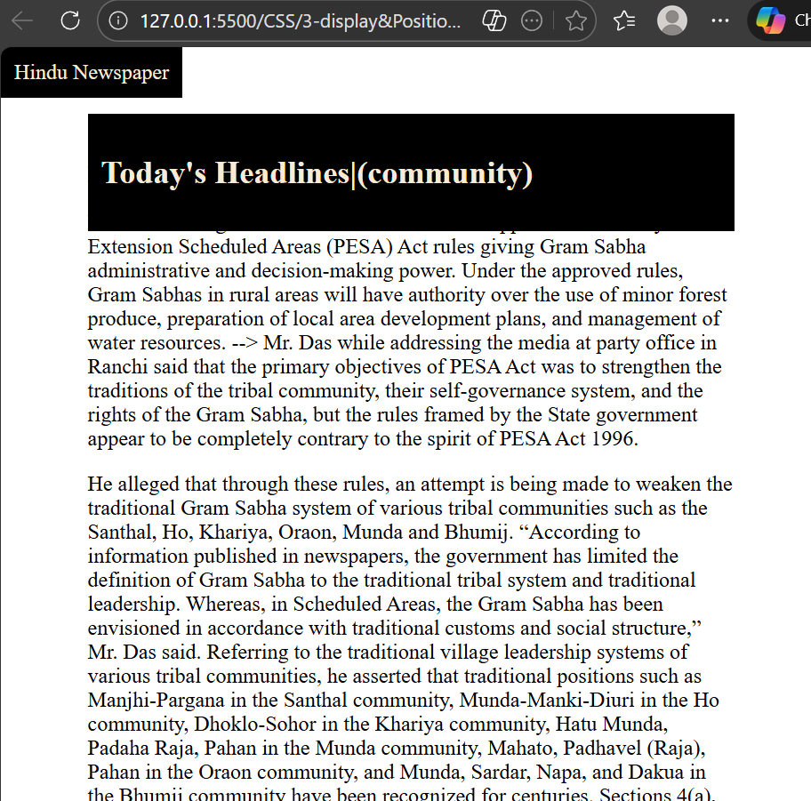
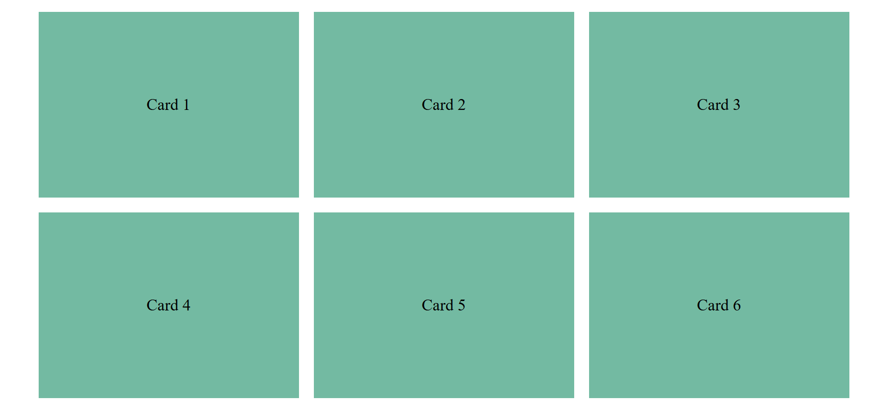

# CSS Learning

## Day 1-Intorduction css ,how to add and Selectors
- Css why we uaing and uses
- How add like inline,internal,external
- And Learned element,class, id selectors and used of howver pseudo class 
- And practices and tasks on selectors

## Outcomes of -1
Learning of css basics and start the practices

## Day 2- Box Model
-  css colors inline,hex colors,RGB & RGBA with opacity HSL & HSLA 
- css units absolute unit px,viewports,typography
- Box Model layer of content,padding,
border,margin
- practicsed box-sizing  and layout spacing and practicing tasks

## Outcome of -2
Learning of colors,units,typorgraphy and box model how to use and practices

## Day 3-Display and Positioning
- learn how to dispaly by block,inline,inline-blcok and do tasks on it
- learn how to controls element in flow using static,relative,absolute,fixed,sticky
- Built fixed & sticky layouts
-  learn css positing by tasks and mini project

### Mini-porject output:

## Outcome of -3
Learning how to display appers and postioning control elements by practicing

## Day 4-Flex Box
- Built responsive layouts
- Used justify-content & align-items
- use flex properties understs
-overflow concept learned controls what haeens content
- do taks and miniporject

### Mini-project output

