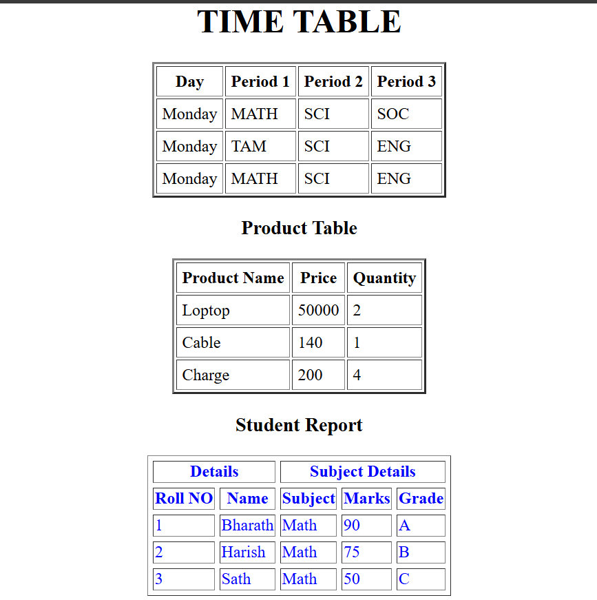
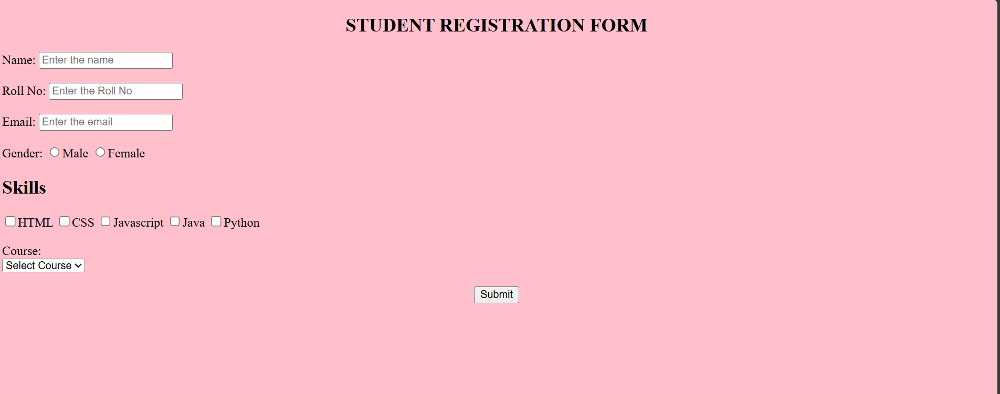
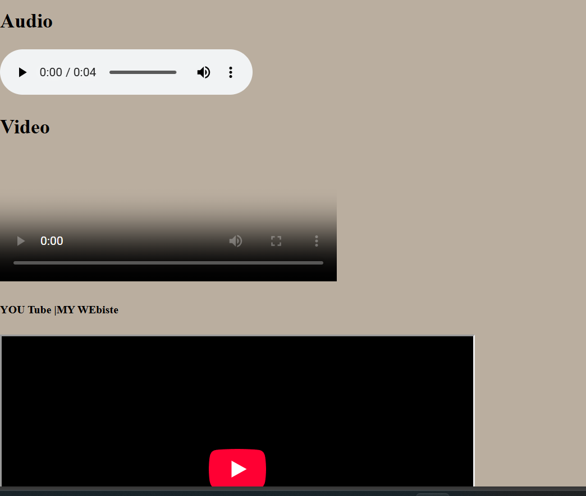

# The Progress of Html

# 1- practicing of HTML

Understanding the itroduction and history-stadarad ansd mark language and use of tags hwere content ot organised
##What practised
understand page structurea and html page and exaple program with pusing in git hb

## Learning Outcome

I learned how a basic HTML page is structured and rendered in the browser

# 2-Leraning of text formating tags

learning of how style and fonts used formatting there were many
the concepts i learned Concepts Covered

- Headings (h1 to h6)
- Paragraphs
- Line break and horizontal rule
- Bold vs Strong
- Italic vs Emphasis

# Learning Outcome day2

as today i leanrned of tags and sematic tags used in html

# 3 -Learning of Lists

Concepts Covered

- Unordered list (ul)
- Ordered list (ol)
- List item (li)
- Nested lists-practised using group of orderder and unoder lists
  And then some advance lists practice of different attributes

# Learning Outcome day 3

I learned when to use ordered vs unordered lists and how to structure nested lists properly and then advance tasks

# 4-HTML Links & Images

## Concepts Covered

- Anchor tag (a)
- External and internal links
- Email links
- Image tag (img)
- Alt attribute

## What I practised

- Created navigation between pages
- used attributes external and internal link
- Add image with alt txt and mix of anchor tag

## Learning Outcome-4

I learned how to create links between pages and why the alt attribute is important
for accessibility and SEO and using images with links.

# 5-|HTML Table
- Practiced basic table structure
- Used thead, tbody, tfoot
- Learned colspan and rowspan and cell spacing and paddding and use advance caption
- Created timetable and product tables
- Built student report mini project

### 5-|HTML Table (Tasks & Miniproject Output)

## Learning outcome
How to stucturly create table and use various forms and tasks  and miniporjects

# 6-HTMl Forms
- Learned form elements and input types
- Practiced radio, checkbox, dropdown,legends and other inputs
- Built student registration form and also small tasks

## Learning outcome-6
how to use forms in html and then how to create register forms by doing tasks and miniporjects

# 7-Media Tags and Meta Tags
- Learned media elements of audio,video,iframe
and do attributes like controls,autoplay,muted,etc
- iframe another web page to out inside page
- small practices on it
## HTML Head & Meta Tags
- Used title, charset, viewport
- Learned basic SEO meta tags
 

## Learning outcome-8
how to create of vido,audio and embeded video using i frame and what is metags and how is used
